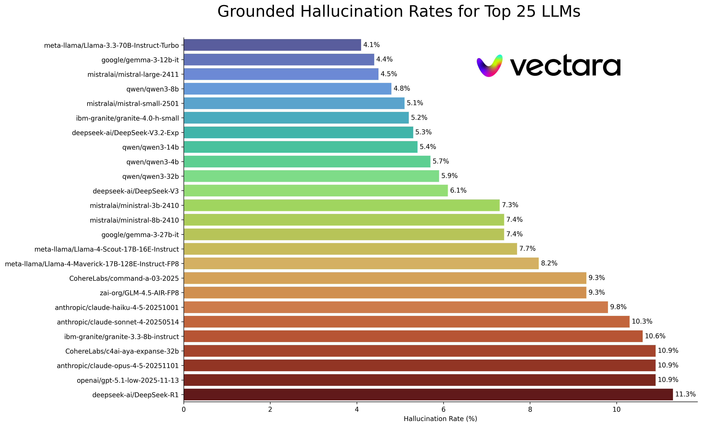

# Hallucination Leaderboard

Public LLM leaderboard computed using Vectara's Hallucination Evaluation Model, also known as HHEM. This evaluates how often an LLM introduces hallucinations when summarizing a document. We plan to update this regularly as our model and the LLMs get updated over time.

Feel free to check out the [interactive hallucination leaderboard](https://huggingface.co/spaces/vectara/leaderboard) on Hugging Face. 

If you are interested in previous versions os this leaderboard:
1. First version based on HHEM-1.0, it is available [here](https://github.com/vectara/hallucination-leaderboard/tree/hhem-1.0-final)
2. Most recent version, based on the previous dataset is available [here](https://github.com/vectara/hallucination-leaderboard/tree/hhem-2.3-old-dataset)

<table style="border-collapse: collapse;">
  <tr>
    <td style="text-align: center; vertical-align: middle; border: none;">
      
    </td>
    <td style="text-align: left; vertical-align: middle; border: none;">
      In loving memory of <a href="https://www.ivinsfuneralhome.com/obituaries/Simon-Mark-Hughes?obId=30000023">Simon Mark Hughes</a>...
    </td>
  </tr>
</table>

<!-- LEADERBOARD_START -->
Last updated on November 25, 2025

|Model|Hallucination Rate|Factual Consistency Rate|Answer Rate|Average Summary Length (Words)|
|----|----:|----:|----:|----:|
|microsoft/Phi-4|3.7 %|96.3 %|80.7 %|120.9|
|meta-llama/Llama-3.3-70B-Instruct-Turbo|4.1 %|95.9 %|99.5 %|64.6|
|snowflake/snowflake-arctic-instruct|4.3 %|95.7 %|62.7 %|81.4|
|google/gemma-3-12b-it|4.4 %|95.6 %|97.4 %|89.7|
|mistralai/mistral-large-2411|4.5 %|95.5 %|99.9 %|85.0|
|qwen/qwen3-8b|4.8 %|95.2 %|99.9 %|83.6|
|mistralai/mistral-small-2501|5.1 %|94.9 %|97.9 %|98.8|
|ibm-granite/granite-4.0-h-small|5.2 %|94.8 %|100.0 %|107.4|
|deepseek-ai/DeepSeek-V3.2-Exp|5.3 %|94.7 %|96.6 %|64.6|
|qwen/qwen3-14b|5.4 %|94.6 %|99.9 %|111.1|
|deepseek-ai/DeepSeek-V3.1|5.5 %|94.5 %|94.5 %|63.7|
|qwen/qwen3-4b|5.7 %|94.3 %|99.9 %|104.7|
|qwen/qwen3-32b|5.9 %|94.1 %|99.9 %|115.8|
|deepseek-ai/DeepSeek-V3|6.1 %|93.9 %|97.5 %|81.7|
|CohereLabs/command-r-plus-08-2024|6.9 %|93.1 %|95.0 %|91.5|
|mistralai/ministral-3b-2410|7.3 %|92.7 %|99.9 %|167.9|
|mistralai/ministral-8b-2410|7.4 %|92.6 %|99.9 %|196.0|
|google/gemma-3-27b-it|7.4 %|92.6 %|98.8 %|96.4|
|meta-llama/Llama-4-Scout-17B-16E-Instruct|7.7 %|92.3 %|99.0 %|137.3|
|meta-llama/Llama-4-Maverick-17B-128E-Instruct-FP8|8.2 %|91.8 %|100.0 %|106.0|
|CohereLabs/command-a-03-2025|9.3 %|90.7 %|97.6 %|101.7|
|qwen/qwen3-next-80b-a3b-thinking|9.3 %|90.7 %|94.4 %|70.9|
|zai-org/GLM-4.5-AIR-FP8|9.3 %|90.7 %|98.1 %|70.6|
|CohereLabs/c4ai-aya-expanse-8b|9.5 %|90.5 %|77.5 %|88.2|
|zai-org/GLM-4.6|9.5 %|90.5 %|94.5 %|77.2|
|anthropic/claude-haiku-4-5-20251001|9.8 %|90.2 %|99.5 %|115.1|
|anthropic/claude-sonnet-4-20250514|10.3 %|89.7 %|98.6 %|145.8|
|ibm-granite/granite-3.3-8b-instruct|10.6 %|89.4 %|100.0 %|131.4|
|CohereLabs/c4ai-aya-expanse-32b|10.9 %|89.1 %|99.8 %|112.7|
|anthropic/claude-opus-4-5-20251101|10.9 %|89.1 %|98.7 %|114.5|
|openai/gpt-5.1-low-2025-11-13|10.9 %|89.1 %|100.0 %|165.5|
|deepseek-ai/DeepSeek-R1|11.3 %|88.7 %|97.0 %|93.5|
|anthropic/claude-opus-4-1-20250805|11.8 %|88.2 %|92.4 %|129.1|
|anthropic/claude-sonnet-4-5-20250929|12.0 %|88.0 %|95.6 %|127.8|
|anthropic/claude-opus-4-20250514|12.0 %|88.0 %|91.0 %|123.2|
|openai/gpt-5.1-high-2025-11-13|12.1 %|87.9 %|100.0 %|254.4|
|xai-org/grok-4-1-fast-non-reasoning|17.8 %|82.2 %|98.5 %|87.5|
|moonshotai/Kimi-K2-Instruct-0905|17.9 %|82.1 %|98.6 %|59.2|
|xai-org/grok-4-1-fast-reasoning|19.2 %|80.8 %|99.7 %|99.5|
|mistralai/mistral-medium-2508|22.7 %|77.3 %|99.7 %|142.9|
|microsoft/Phi-4-mini-instruct|23.5 %|76.5 %|92.5 %|420.2|

<!-- LEADERBOARD_END -->

## Model
This leaderboard uses HHEM-2.3, Vectara's commercial hallucination evaluation model, to compute the LLM rankings. You can find an open-source variant of that model, HHEM-2.1-Open on [Hugging Face](https://huggingface.co/vectara/hallucination_evaluation_model) and [Kaggle](https://www.kaggle.com/models/vectara/hallucination_evaluation_model).

## Dataset
The dataset used for this leaderboard is carefully curated as follows:
* Not publicly available to avoid overfitting by any LLM
* Contains over 7700 articles from a variery of sources includeing: news, technology, science, medicine, legal, sports, sports, business and education.
* Contains articles in both low and high complexity, from as short as 50 words to as long as 24K words.

## Prior Research
Much prior work in this area has been done. For some of the top papers in this area (factual consistency in summarization) please see here:

* [SUMMAC: Re-Visiting NLI-based Models for Inconsistency Detection in Summarization](https://aclanthology.org/2022.tacl-1.10.pdf)
* [TRUE: Re-evaluating Factual Consistency Evaluation](https://arxiv.org/pdf/2204.04991.pdf)
* [TrueTeacher: Learning Factual Consistency Evaluation with Large Language Models](https://browse.arxiv.org/pdf/2305.11171v1.pdf)
* [ALIGNSCORE: Evaluating Factual Consistency with A Unified Alignment Function](https://arxiv.org/pdf/2305.16739.pdf)
* [MiniCheck: Efficient Fact-Checking of LLMs on Grounding Documents](https://arxiv.org/pdf/2404.10774)
* [TOFUEVAL: Evaluating Hallucinations of LLMs on Topic-Focused Dialogue Summarization](https://arxiv.org/pdf/2402.13249)
* [RAGTruth: A Hallucination Corpus for Developing Trustworthy Retrieval-Augmented Language Models](https://aclanthology.org/2024.acl-long.585.pdf)
* [FaithBench: A Diverse Hallucination Benchmark for Summarization by Modern LLMs](https://aclanthology.org/2025.naacl-short.38.pdf)

For a very comprehensive list, please see here - https://github.com/EdinburghNLP/awesome-hallucination-detection. The methods described in the following section use protocols established in those papers, amongst many others.

## Methodology
For a detailed explanation of the work that went into this model please refer to our blog posts
* [Cut the Bull…. Detecting Hallucinations in Large Language Models](https://vectara.com/blog/cut-the-bull-detecting-hallucinations-in-large-language-models/).
* [Introducing the Next Generation of Vectara's Hallucination Leaderboard](https://vectara.com/blog/TBD)

To build this leaderboard, fed the full set of documents in the dataset to each of the LLMs and asked them to summarize each document, using only the facts presented in the document. We then computed the overall factual consistency rate (no hallucinations) and hallucination rate (100 - accuracy) for each model. The rate at which each model refuses to respond to the prompt is detailed in the 'Answer Rate' column. None of the content sent to the models contained illicit or 'not safe for work' content but the present of trigger words was enough to trigger some of the content filters. We used a **temperature of 0** when calling the LLMs, except where that was impossible or not available.

We evaluate summarization factual consistency rate instead of overall factual accuracy because it allows us to compare the model's response to the provided information. In other words, is the summary provided 'factually consistent' with the source document. Determining hallucinations is impossible to do for any ad hoc question as it's not known precisely what data every LLM is trained on. In addition, having a model that can determine whether any response was hallucinated without a reference source requires solving the hallucination problem and presumably training a model as large or larger than these LLMs being evaluated. So we instead chose to look at the hallucination rate within the summarization task as this is a good analogue to determine how truthful the models are overall. 

In addition, LLMs are increasingly used in RAG (Retrieval Augmented Generation) and Agentic pipelines to answer user queries, where the model is being deployed as a summarizer of the search results, so this leaderboard is also a good indicator for the accuracy of the models when used in RAG or agentic systems.

## Prompt Used
> Your task is to provide a concise and factual summary for the given passage.
> Rules
> 1. Summarize using only the information in the given passage. Do not infer. Do not use your internal knowledge.
> 2. Do not provide a preamble or explanation, output only the summary.
> 3. Summaries should never exceed 20 percent of the original text's length.
> 4. Maintain the tone of the passage.
> If you are unable to summarize the text due to missing, unreadable, irrelevant or insufficient content, respond only with:
> "I am unable to summarize this text."
> Here is the passage:
> &lt;PASSAGE&gt;

When calling the API, the &lt;PASSAGE&gt; variable was then replaced with the source document.

## API Integration Details
Below is a detailed overview of the models integrated and their specific endpoints:

### Anthropic Model
- **Claude Sonnet 4, Claude Opus 4**: Invoked the model using `claude-sonnet-4-20250514` and `claude-opus-4-20250514`
- **Claude Opus 4.1**: Invoked the model using `claude-opus-4-1-20250805`.
- **Claude Sonnet 4.5, Claude Haiku 4.5**: Invoked the model using `claude-haiku-4-5-20251001` and `claude-sonnet-4-5-20250929`
Details on each model can be found on their [website](https://docs.anthropic.com/claude/docs/models-overview).

### Cohere Models
- **Cohere Command R**: Employed using the model `command-r-08-2024` and the `/chat` endpoint.
- **Cohere Command R Plus**: Employed using the model `command-r-plus-08-2024` and the `/chat` endpoint.
- **Aya Expanse 8B, 32B**: Accessed using models `c4ai-aya-expanse-8b` and `c4ai-aya-expanse-32b`.
- **Cohere Command A**: Employed using the model `command-a-03-2025` and the `/chat` endpoint.
For more information about Cohere's models, refer to their [website](https://docs.cohere.com/docs/models).

### DeepSeek Model
- **DeepSeek V3**: Accessed via huggingface inference provider.
- **DeepSeek V3.1**: Accessed via huggingface inference provider.
- **DeepSeek V3.2-Exp**: Accessed via huggingface inference provider.
- **DeepSeek R1**: Accessed via huggingface inference provider.

### Google Closed-Source Models via Vertex AI
- **Gemini 2.5 pro, Gemini 2.5 flash and Gemini 2.5 Flash lite**: Accessed using model `gemini-2.5-pro`, `gemini-2.5-flash` and `gemini-2.5-flash-lite` on Vertex AI. 

For an in-depth understanding of each model's version and lifecycle, especially those offered by Google, please refer to [Model Versions and Lifecycles](https://cloud.google.com/vertex-ai/docs/generative-ai/learn/model-versioning) on Vertex AI.

### IBM Models
- **Granite-3.3-Instruct 8B**: The model is accessed via Replicate API.
- **Granite-4.0-h-small**: The model is accessed via Replicate API.

### Llama Models
- **Llama 3.3 70B Instruct Turbo**: Accessed via Together AI.
- **Llama 4 Maverick 17B 128E Instruct FP8**: Accessed via Together AI.
- **Llama 4 Scout 17B 16E Instruct**: Accessed via Together AI.

### Microsoft Models
- **Microsoft Phi-4/Phi-4-Mini**: The [phi-4](https://huggingface.co/microsoft/phi-4) and [phi-4-mini](https://huggingface.co/microsoft/Phi-4-mini-instruct) are accesed via Azure.

### Mistral AI Models
- **Mistral Ministral 3B**: Accessed via Mistral AI's API using the model `ministral-3b-2410`.
- **Mistral Ministral 8B**: Accessed via Mistral AI's API using the model `ministral-8b-2410`.
- **Mistral Large**: Accessed via Mistral AI's API using the model `mistral-large-2411`.
- **Mistral Medium**: Accessed via Mistral AI's API using the model `mistral-large-2508`.
- **Mistral Small**: Accessed via Mistral AI's API using the model `mistral-small-2501`.

### Moonshot AI Models
- **Kimi-K2-Instruct-0905**: Accessed via Moonshot AI API.

### OpenAI Models
- **GPT-4.1 2025-04-14**: Accessed via OpenAI API.
- **GPT-4o 2024-08-06**: Accessed via OpenAI API.
- **GPT-5-High 2025-08-07**: Accessed via OpenAI API.
- **GPT-5-Mini 2025-08-07**: Accessed via OpenAI API.
- **GPT-5-Minimal 2025-08-07**: Accessed via OpenAI API.
- **GPT-5-Nano 2025-08-07**: Accessed via OpenAI API.
- **GPT-OSS-120B**: Accessed via Together AI API.
- **o3-Pro**: Accessed via OpenAI API.
- **o4-Mini-High 2025-04-16**: Accessed via OpenAI API.
- **o4-Mini-Low 2025-04-16**: Accessed via OpenAI API.

### Qwen Models
- **Qwen3-4b, Qwen3-8b, Qwen3-14b, Qwen3-32b**: Accessed through dashscope API
- **Qwen3-80b-a3b-thinking**: Accessed through dashscope API

### Snowflake Models
- **Snowflake-Arctic-Instruct**: The model is accessed via Replicate API.

### XAI Model
- **Grok-3**: Accessed via xAI's API.
- **Grok-4-Fast-Reasoning**: Accessed via xAI's API.
- **Grok-4-Fast-Non-Reasoning**: Accessed via xAI's API.

### Zhipu AI Model
- **GLM-4.5-AIR-FP8**: Accessed via Together AI.
- **GLM-4.6**: Accessed via deepinfra.

## Frequently Asked Questions
* **Question** Why are you are using a model to evaluate a model?
* **Answer** There are several reasons we chose to do this over a human evaluation. While we could have crowdsourced a large human scale evaluation, that's a one time thing, it does not scale in a way that allows us to constantly update the leaderboard as new APIs come online or models get updated. We work in a fast moving field so any such process would be out of data as soon as it published. Secondly, we wanted a repeatable process that we can share with others so they can use it themselves as one of many LLM quality scores they use when evaluating their own models. This would not be possible with a human annotation process, where the only things that could be shared are the process and the human labels. It's also worth pointing out that building a model for detecting hallucinations is **much easier** than building a generative model that never produces hallucinations. So long as the hallucination evaluation model is highly correlated with human raters' judgements, it can stand in as a good proxy for human judges. As we are specifically targetting summarization and not general 'closed book' question answering, the LLM we trained does not need to have memorized a large proportion of human knowledge, it just needs to have a solid grasp and understanding of the languages it support (currently just english, but we plan to expand language coverage over time).

* **Question** What if the LLM refuses to summarize the document or provides a one or two word answer?
* **Answer** We explicitly filter these out. See our [blog post](https://vectara.com/blog/cut-the-bull-detecting-hallucinations-in-large-language-models/) for more information. You can see the 'Answer Rate' column on the leaderboard that indicates the percentage of documents summarized, and the 'Average Summary Length' column detailing the summary lengths, showing we didn't get very short answers for most documents.

* **Question** What version of model XYZ did you use?
* **Answer** Please see the API details section for specifics about the model versions used and how they were called, as well as the date the leaderboard was last updated. Please contact us (create an issue in the repo) if you need more clarity. 

* **Question** Can't a model just score a 100% by providing either no answers or very short answers?
* **Answer** We explicitly filtered out such responses from every model, doing the final evaluation only on documents that all models provided a summary for. You can find out more technical details in our [blog post]([https://vectara.com/blog/cut-the-bull-detecting-hallucinations-in-large-language-models/) on the topic. See also the 'Answer Rate' and 'Average Summary Length' columns in the table above.

* **Question** Wouldn't an extractive summarizer model that just copies and pastes from the original summary score 100% (0 hallucination) on this task?
* **Answer** Absolutely as by definition such a model would have no hallucinations and provide a faithful summary. We do not claim to be evaluating summarization quality, that is a separate and **orthogonal** task, and should be evaluated independently. We are **not** evaluating the quality of the summaries, only the **factual consistency** of them, as we point out in the [blog post](https://vectara.com/cut-the-bull-detecting-hallucinations-in-large-language-models/).

* **Question** This seems a very hackable metric, as you could just copy the original text as the summary
* **Answer** That's true but we are not evaluating arbitrary models on this approach, e.g. like in a Kaggle competition. Any model that does so would perform poorly at any other task you care about. So I would consider this as quality metric that you'd run alongside whatever other evaluations you have for your model, such as summarization quality, question answering accuracy, etc. But we do not recommend using this as a standalone metric. None of the models chosen were trained on our model's output. That may happen in future but as we plan to update the model and also the source documents so this is a living leaderboard, that will be an unlikely occurrence. That is however also an issue with any LLM benchmark. We should also point out this builds on a large body of work on factual consistency where many other academics invented and refined this protocol. See our references to the SummaC and True papers in this [blog post](https://vectara.com/blog/cut-the-bull-detecting-hallucinations-in-large-language-models/), as well as this excellent compilation of resources - https://github.com/EdinburghNLP/awesome-hallucination-detection to read more.

* **Question** This does not definitively measure all the ways a model can hallucinate
* **Answer** Agreed. We do not claim to have solved the problem of hallucination detection, and plan to expand and enhance this process further. But we do believe it is a move in the right direction, and provides a much needed starting point that everyone can build on top of.

* **Question** Some models could hallucinate only while summarizing. Couldn't you just provide it a list of well known facts and check how well it can recall them?
* **Answer** That would be a poor test in my opinion. For one thing, unless you trained the model you don't know the data it was trained on, so you can't be sure the model is grounding its response in real data it has seen on or whether it is guessing. Additionally, there is no clear definition of 'well known', and these types of data are typically easy for most models to accurately recall. Most hallucinations, in my admittedly subjective experience, come from the model fetching information that is very rarely known or discussed, or facts for which the model has seen conflicting information. Without knowing the source data the model was trained on, again it's impossible to validate these sort of hallucinations as you won't know which data fits this criterion. I also think its unlikely the model would only hallucinate while summarizing. We are asking the model to take information and transform it in a way that is still faithful to the source. This is analogous to a lot of generative tasks aside from summarization (e.g. write an email covering these points...), and if the model deviates from the prompt then that is a failure to follow instructions, indicating the model would struggle on other instruction following tasks also.

* **Question** This is a good start but far from definitive
* **Answer** We agree. There's a lot more that needs to be done, and the problem is far from solved. But a 'good start' means that hopefully progress will start to be made in this area, and by open sourcing the model, we hope to involve the community into taking this to the next level.

## Additional Resources
* Check our [Open-RAG-Eval](https://github.com/vectara/open-rag-eval): an open source RAG evaluation framework that uses HHEM but also provides metrics for retreival, groundedness, and citations
* Check out the commercial version of the HHEM model (see [API docs](https://docs.vectara.com/docs/rest-api/evaluate-factual-consistency), which has better detection characteristics and supports multiple languages.
* For more information about Vectara or if you want to schedule a demo, contact us [here](https://www.vectara.com/contact-us).

