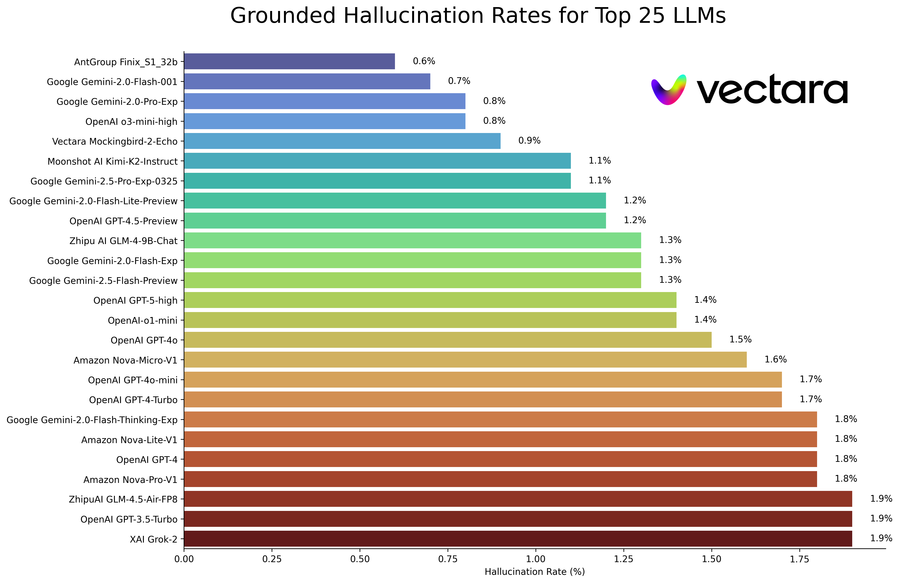

# Hallucination Leaderboard

Public LLM leaderboard computed using Vectara's [Hughes Hallucination Evaluation Model](https://huggingface.co/vectara/hallucination_evaluation_model). This evaluates how often an LLM introduces hallucinations when summarizing a document. We plan to update this regularly as our model and the LLMs get updated over time.

Also, feel free to check out our [hallucination leaderboard](https://huggingface.co/spaces/vectara/leaderboard) on Hugging Face. 

The rankings in this leaderboard are computed using the HHEM-2.1 hallucination evaluation model. 
If you are interested in the previous leaderboard, which was based on HHEM-1.0, it is available [here](https://github.com/vectara/hallucination-leaderboard/tree/hhem-1.0-final)

<table style="border-collapse: collapse;">
  <tr>
    <td style="text-align: center; vertical-align: middle; border: none;">
      
    </td>
    <td style="text-align: left; vertical-align: middle; border: none;">
      In loving memory of <a href="https://www.ivinsfuneralhome.com/obituaries/Simon-Mark-Hughes?obId=30000023">Simon Mark Hughes</a>...
    </td>
  </tr>
</table>

Last updated on October 16, 2025

|Model|Hallucination Rate|Factual Consistency Rate|Answer Rate|Average Summary Length (Words)|
|----|----:|----:|----:|----:|
|AntGroup Finix-S1-32B|0.6 %|99.4 %|99.8 %|86.9|
|Google Gemini-2.0-Flash-001|0.7 %|99.3 %|100.0 %|65.2|
|Google Gemini-2.0-Pro-Exp|0.8 %|99.2 %|99.7 %|61.5|
|OpenAI o3-mini-high|0.8 %|99.2 %|100.0 %|79.5|
|Vectara Mockingbird-2-Echo|0.9 %|99.1 %|100.0 %|74.0|
|Moonshot AI Kimi-K2-Instruct|1.1 %|98.9 %|89.5 %|73.2|
|Google Gemini-2.5-Pro-Exp-0325|1.1 %|98.9 %|95.1 %|72.9|
|Google Gemini-2.0-Flash-Lite-Preview|1.2 %|98.8 %|99.5 %|60.9|
|OpenAI GPT-4.5-Preview|1.2 %|98.8 %|100.0 %|77.0|
|Zhipu AI GLM-4-9B-Chat|1.3 %|98.7 %|100.0 %|58.1|
|Google Gemini-2.0-Flash-Exp|1.3 %|98.7 %|99.9 %|60.0|
|Google Gemini-2.5-Flash-Preview|1.3 %|98.7 %|91.2 %|71.1|
|OpenAI GPT-5-high|1.4 %|98.6 %|99.3 %|96.4|
|OpenAI-o1-mini|1.4 %|98.6 %|100.0 %|78.3|
|OpenAI GPT-4o|1.5 %|98.5 %|100.0 %|77.8|
|Amazon Nova-Micro-V1|1.6 %|98.4 %|100.0 %|90.0|
|OpenAI GPT-4o-mini|1.7 %|98.3 %|100.0 %|76.3|
|OpenAI GPT-4-Turbo|1.7 %|98.3 %|100.0 %|86.2|
|Google Gemini-2.0-Flash-Thinking-Exp|1.8 %|98.2 %|99.3 %|73.2|
|Amazon Nova-Lite-V1|1.8 %|98.2 %|99.9 %|80.7|
|OpenAI GPT-4|1.8 %|98.2 %|100.0 %|81.1|
|Amazon Nova-Pro-V1|1.8 %|98.2 %|100.0 %|85.5|
|ZhipuAI GLM-4.5-Air-FP8|1.9 %|98.1 %|99.1 %|74.4|
|OpenAI GPT-3.5-Turbo|1.9 %|98.1 %|99.6 %|84.1|
|XAI Grok-2|1.9 %|98.1|100.0 %|86.5|
|OpenAI GPT-4.1-nano|2.0 %|98.0 %|100.0 %|70.2|
|OpenAI GPT-4.1|2.0 %|98.0 %|100.0 %|71.9|
|XAI Grok-3-Beta|2.1 %|97.8|100.0 %|97.7|
|OpenAI GPT-4.1-mini|2.2 %|97.8 %|100.0 %|79.6|
|Qwen3-14B|2.2 %|97.8 %|100.0 %|82.4|
|AI21 Jamba-1.6-Large|2.3 %|97.7 %|99.9 %|85.6 |
|OpenAI gpt-oss-120b|2.4 %|97.6 %|100.0 %|82.3|
|OpenAI o1-Pro|2.4 %|97.6 %|100.0 %|81.0|
|OpenAI o1|2.4 %|97.6 %|99.9 %|73.0|
|DeepSeek-V2.5|2.4 %|97.6 %|100.0 %|83.2|
|Microsoft Orca-2-13b|2.5 %|97.5 %|100.0 %|66.2|
|Microsoft Phi-3.5-MoE-instruct|2.5 %|97.5 %|96.3 %|69.7|
|Google Gemini-2.5-Pro-Preview-06-05|2.6 %|97.4 %|99.6 %|73.1|
|Intel Neural-Chat-7B-v3-3|2.6 %|97.4 %|100.0 %|60.7|
|Qwen3-4B|2.7 %|97.3 %|100.0 %|87.7|
|Google Gemma-3-12B-Instruct|2.8 %|97.2 %|100.0 %|69.6|
|Qwen2.5-7B-Instruct|2.8 %|97.2 %|100.0 %|71.0|
|Qwen3-32B|2.8 %|97.2 %|100.0 %|82.4|
|Google Gemini-2.5-Flash-Lite|2.9 %|97.1 %|99.7 %|78.4|
|AI21 Jamba-1.5-Mini|2.9 %|97.1 %|95.6 %|74.5|
|XAI Grok-2-Vision|2.9 %|97.1|100.0 %|79.8|
|Qwen2.5-Max|2.9 %|97.1 %|88.8 %|90.4|
|Google Gemma-3-27B-Instruct|3.0 %|97.0 %|100.0 %|62.5|
|Qwen2.5-32B-Instruct|3.0 %|97.0 %|100.0 %|67.9|
|Snowflake-Arctic-Instruct|3.0 %|97.0 %|100.0 %|68.7|
|Qwen3-8B|3.0 %|97.0 %|100.0 %|78.2|
|Microsoft Phi-3-mini-128k-instruct|3.1 %|96.9 %|100.0 %|60.1|
|Mistral Small3|3.1 %|96.9 %|100.0 %|74.9|
|OpenAI GPT-5-mini|3.2 %|96.8 %|99.6 %|87.2|
|XAI Grok-3-Mini-Beta|3.3 %|96.7|100.0 %|90.2|
|OpenAI o1-preview|3.3 %|96.7 %|100.0 %|119.3|
|Google Gemini-1.5-Flash-002|3.4 %|96.6 %|99.9 %|59.4|
|Microsoft Phi-4-mini-instruct|3.4 %|96.6 %|100.0 %|69.7|
|OpenAI gpt-oss-20b|3.7 %|96.3 %|99.4 %|90.0|
|Qwen3-next-80b-a3b-thinking|3.7 %|96.3 %|99.7 %|64.6|
|ZhipuAI GLM-4.5|3.7 %|96.3 %|99.1 %|81.1|
|Google Gemma-3-4B-Instruct|3.7 %|96.3 %|100.0 %|63.7|
|Qwen3-0.6B|3.7 %|96.3 %|100.0 %|65.3|
|01-AI Yi-1.5-34B-Chat|3.7 %|96.3 %|100.0 %|83.7|
|Qwen3-Max-Preview|3.8 %|96.2 %|97.0 %|80.8|
|Llama-3.1-405B-Instruct|3.9 %|96.1 %|99.6 %|85.7|
|DeepSeek-V3|3.9 %|96.1 %|100.0 %|88.2|
|Microsoft Phi-3-mini-4k-instruct|4.0 %|96.0 %|100.0 %|86.8|
|Llama-3.3-70B-Instruct|4.0 %|96.0 %|100.0 %|85.3|
|InternLM3-8B-Instruct|4.0 %|96.0 %|100.0 %|97.5|
|Microsoft Phi-3.5-mini-instruct|4.1 %|95.9 %|100.0 %|75.0|
|Mistral-Large2|4.1 %|95.9 %|100.0 %|77.4|
|Llama-3-70B-Chat-hf|4.1 %|95.9 %|99.2 %|68.5|
|Anthropic Claude-Opus-4.1|4.2 %|95.8 %|98.2 %|107.3|
|Qwen2-VL-7B-Instruct|4.2 %|95.8 %|100.0 %|73.9|
|Qwen2.5-14B-Instruct|4.2 %|95.8 %|100.0 %|74.8|
|Qwen2.5-72B-Instruct|4.3 %|95.7 %|100.0 %|80.0|
|Llama-3.2-90B-Vision-Instruct|4.3 %|95.7 %|100.0 %|79.8|
|ZhipuAI GLM-4.6|4.3 %|95.7 %|98.3 %|64.0|
|Qwen3-1.7B|4.4 %|95.6 %|100.0 %|69.0|
|Claude-3.7-Sonnet|4.4 %|95.6 %|100.0 %|97.8|
|Claude-Haiku-4-5|4.5 %|95.5 %|99.7 %|83.9|
|Claude-4-Sonnet|4.5 %|95.5 %|100.0 %|116.0|
|Claude-3.7-Sonnet-Think|4.5 %|95.5 %|99.8 %|99.9|
|Cohere Command-A|4.5 %|95.5 %|100.0 %|77.3|
|DeepSeek-AI DeepSeek-V3.2-Exp|4.6 %|95.4 %|99.3 %|61.9|
|OpenAI o4-mini|4.6 %|95.4 %|100.0 %|82.0|
|AI21 Jamba-1.6-Mini|4.6 %|95.4 %|100.0 %|82.3 |
|Meta Llama-4-Maverick|4.6 %|95.4 %|100.0 %|84.8|
|XAI Grok|4.6 %|95.4 %|100.0 %|91.0|
|Anthropic Claude-3-5-sonnet|4.6 %|95.4 %|100.0 %|95.9|
|OpenAI GPT-5-nano|4.7 %|95.3 %|99.9 %|72.7|
|Meta Llama-4-Scout|4.7 %|95.3 %|100.0 %|80.7|
|Qwen2-72B-Instruct|4.7 %|95.3 %|100.0 %|100.1|
|Microsoft Phi-4|4.7 %|95.3 %|100.0 %|100.3|
|Mixtral-8x22B-Instruct-v0.1|4.7 %|95.3 %|99.9 %|92.0|
|Claude-4-Opus|4.8 %|95.2 %|100.0 %|110.0|
|Qwen3-30b-a3b-thinking-2507|4.8 %|95.2 %|98.2 %|68.0|
|XAI Grok-4-0709|4.8 %|95.2 %|99.8 %|100.6|
|OpenAI GPT-5-minimal|4.9 %|95.1 %|99.7 %|83.6|
|Anthropic Claude-3-5-haiku|4.9 %|95.1 %|100.0 %|92.9|
|01-AI Yi-1.5-9B-Chat|4.9 %|95.1 %|100.0 %|85.7|
|Cohere Command-R|4.9 %|95.1 %|100.0 %|68.7|
|Llama-3.1-70B-Instruct|5.0 %|95.0 %|100.0 %|79.6|
|OpenAI o4-mini-high|5.1 %|94.9 %|98.2 %|79.2|
|Google Gemma-3-1B-Instruct|5.3 %|94.7 %|99.9 %|57.9|
|Llama-3.1-8B-Instruct|5.4 %|94.6 %|100.0 %|71.0|
|Cohere Command-R-Plus|5.4 %|94.6 %|100.0 %|68.4|
|Anthropic Claude-Sonnet-4-5-20250929|5.5 %|94.5 %|99.4 %|87.7|
|DeepSeek-AI DeepSeek-V3.1|5.5 %|94.5 %|98.7 %|78.0|
|Llama-3.2-11B-Vision-Instruct|5.5 %|94.5 %|100.0 %|67.3|
|TNGTech DeepSeek-TNG-R1T2-Chimera|5.5 %|94.5 %|99.6 %|78.6|
|Mistral-Small-3.1-24B-Instruct|5.6 %|94.4 %|100.0 %|73.1|
|Llama-2-70B-Chat-hf|5.9 %|94.1 %|99.9 %|84.9|
|MoonshotAI Kimi-K2-Instruct-0905|6.2%|93.8 %|99.6 %|61.2|
|IBM Granite-3.0-8B-Instruct|6.5 %|93.5 %|100.0 %|74.2|
|IBM Granite-4.0-micro|6.5 %|93.5 %|100.0 %|59.0|
|Google Gemini-1.5-Pro-002|6.6 %|93.7 %|99.9 %|62.0|
|Google Gemini-1.5-Flash|6.6 %|93.4 %|99.9 %|63.3|
|Mistral-Pixtral|6.6 %|93.4 %|100.0 %|76.4|
|Microsoft phi-2|6.7 %|93.3 %|91.5 %|80.8|
|OpenAI o4-mini-low|6.8 %|93.2 %|99.8 %|81.6|
|OpenAI o3|6.8 %|93.2 %|100.0 %|77.7|
|Google Gemma-2-2B-it|7.0 %|93.0 %|100.0 %|62.2|
|Qwen2.5-3B-Instruct|7.0 %|93.0 %|100.0 %|70.4|
|IBM Granite-4.0-h-tiny|7.3 %|92.7 %|99.9 %|94.7|
|Llama-3-8B-Chat-hf|7.4 %|92.6 %|99.8 %|79.7|
|Mistral-Ministral-8B|7.5 %|92.5 %|100.0 %|62.7|
|Google Gemini-Pro|7.7 %|92.3 %|98.4 %|89.5|
|DeepSeek-R1-0528|7.7 %|92.3 %|100.0 %|138.9|
|01-AI Yi-1.5-6B-Chat|7.9 %|92.1 %|100.0 %|98.9|
|Llama-3.2-3B-Instruct|7.9 %|92.1 %|100.0 %|72.2|
|DeepSeek-V3-0324|8.0 %|92.0 %|100.0 %|78.9|
|Mistral-Ministral-3B|8.3 %|91.7 %|100.0 %|73.2|
|databricks dbrx-instruct|8.3 %|91.7 %|100.0 %|85.9|
|Qwen2-VL-2B-Instruct|8.3 %|91.7 %|100.0 %|81.8|
|IBM Granite-4.0-h-micro|8.4 %|91.6 %|100.0 %|71.8|
|Cohere Aya Expanse 32B|8.5 %|91.5 %|99.9 %|81.9|
|IBM Granite-3.1-8B-Instruct|8.6 %|91.4 %|100.0 %|107.4|
|Mistral-Small2|8.6 %|91.4 %|100.0 %|74.2|
|IBM Granite-3.2-8B-Instruct|8.7 %|91.3 %|100.0 %|120.1|
|IBM Granite-3.0-2B-Instruct|8.8 %|91.2 %|100.0 %|81.6|
|Mistral-7B-Instruct-v0.3|9.5 %|90.5 %|100.0 %|98.4|
|Google Gemini-1.5-Pro|9.1 %|90.9 %|99.8 %|61.6|
|Anthropic Claude-3-opus|10.1 %|89.9 %|95.5 %|92.1|
|Google Gemma-2-9B-it|10.1 %|89.9 %|100.0 %|70.2|
|Llama-2-13B-Chat-hf|10.5 %|89.5 %|99.8 %|82.1|
|AllenAI-OLMo-2-13B-Instruct|10.8 %|89.2 %|100.0 %|82.0|
|AllenAI-OLMo-2-7B-Instruct|11.1 %|88.9 %|100.0 %|112.6|
|Mistral-Nemo-Instruct|11.2 %|88.8 %|100.0 %|69.9|
|Llama-2-7B-Chat-hf|11.3 %|88.7 %|99.6 %|119.9|
|MistralAI Mistral-Medium-2508|11.4 %|88.6 %|98.3 %|99.2|
|Microsoft WizardLM-2-8x22B|11.7 %|88.3 %|99.9 %|140.8|
|Cohere Aya Expanse 8B|12.2 %|87.8 %|99.9 %|83.9|
|Amazon Titan-Express|13.5 %|86.5 %|99.5 %|98.4|
|Google PaLM-2|14.1 %|85.9 %|99.8 %|86.6|
|DeepSeek-R1|14.3 %|85.7 %|100.0%|77.1|
|Google Gemma-7B-it|14.8 %|85.2 %|100.0 %|113.0|
|IBM Granite-3.1-2B-Instruct|15.7 %|84.3 %|100.0 %|107.7|
|Qwen2.5-1.5B-Instruct|15.8 %|84.2 %|100.0 %|70.7|
|Qwen-QwQ-32B-Preview|16.1 %|83.9 %|100.0 %|201.5|
|Anthropic Claude-3-sonnet|16.3 %|83.7 %|100.0 %|108.5|
|IBM Granite-3.2-2B-Instruct|16.5 %|83.5 %|100.0 %|117.7|
|Google Gemma-1.1-7B-it|17.0 %|83.0 %|100.0 %|64.3|
|Anthropic Claude-2|17.4 %|82.6 %|99.3 %|87.5|
|Google Flan-T5-large|18.3 %|81.7 %|99.3 %|20.9|
|Mixtral-8x7B-Instruct-v0.1|20.1 %|79.9 %|99.9 %|90.7|
|Llama-3.2-1B-Instruct|20.7 %|79.3 %|100.0 %|71.5|
|Apple OpenELM-3B-Instruct|24.8 %|75.2 %|99.3 %|47.2|
|Qwen2.5-0.5B-Instruct|25.2 %|74.8 %|100.0 %|72.6|
|Google Gemma-1.1-2B-it|27.8 %|72.2 %|100.0 %|66.8|
|TII falcon-7B-instruct|29.9 %|70.1 %|90.0 %|75.5|

## Model
This leaderboard uses HHEM-2.1, Vectara's commercial hallucination evaluation model, to compute the LLM rankings. You can find an open-source variant of that model, HHEM-2.1-Open on [Hugging Face](https://huggingface.co/vectara/hallucination_evaluation_model) and [Kaggle](https://www.kaggle.com/models/vectara/hallucination_evaluation_model).

## Data
See [this dataset](https://huggingface.co/datasets/vectara/leaderboard_results) for the generated summaries we used for evaluating the models.

## Prior Research
Much prior work in this area has been done. For some of the top papers in this area (factual consistency in summarization) please see here:

* [SUMMAC: Re-Visiting NLI-based Models for Inconsistency Detection in Summarization](https://aclanthology.org/2022.tacl-1.10.pdf)
* [TRUE: Re-evaluating Factual Consistency Evaluation](https://arxiv.org/pdf/2204.04991.pdf)
* [TrueTeacher: Learning Factual Consistency Evaluation with Large Language Models](https://browse.arxiv.org/pdf/2305.11171v1.pdf)
* [ALIGNSCORE: Evaluating Factual Consistency with A Unified Alignment Function](https://arxiv.org/pdf/2305.16739.pdf)
* [MiniCheck: Efficient Fact-Checking of LLMs on Grounding Documents](https://arxiv.org/pdf/2404.10774)

For a very comprehensive list, please see here - https://github.com/EdinburghNLP/awesome-hallucination-detection. The methods described in the following section use protocols established in those papers, amongst many others.

## Methodology
For a detailed explanation of the work that went into this model please refer to our blog post on the release: [Cut the Bull…. Detecting Hallucinations in Large Language Models](https://vectara.com/blog/cut-the-bull-detecting-hallucinations-in-large-language-models/).

To determine this leaderboard, we trained a model to detect hallucinations in LLM outputs, using various open source datasets from the factual consistency research into summarization models. Using a model that is competitive with the best state of the art models, we then fed 1000 short documents to each of the LLMs above via their public APIs and asked them to summarize each short document, using only the facts presented in the document. Of these 1000 documents, only 831 document were summarized by every model, the remaining documents were rejected by at least one model due to content restrictions. Using these 831 documents, we then computed the overall factual consistency rate (no hallucinations) and hallucination rate (100 - accuracy) for each model. The rate at which each model refuses to respond to the prompt is detailed in the 'Answer Rate' column. None of the content sent to the models contained illicit or 'not safe for work' content but the present of trigger words was enough to trigger some of the content filters. The documents were taken primarily from the [CNN / Daily Mail Corpus](https://huggingface.co/datasets/cnn_dailymail/viewer/1.0.0/test). We used a **temperature of 0** when calling the LLMs.

We evaluate summarization factual consistency rate instead of overall factual accuracy because it allows us to compare the model's response to the provided information. In other words, is the summary provided 'factually consistent' with the source document. Determining hallucinations is impossible to do for any ad hoc question as it's not known precisely what data every LLM is trained on. In addition, having a model that can determine whether any response was hallucinated without a reference source requires solving the hallucination problem and presumably training a model as large or larger than these LLMs being evaluated. So we instead chose to look at the hallucination rate within the summarization task as this is a good analogue to determine how truthful the models are overall. In addition, LLMs are increasingly used in RAG (Retrieval Augmented Generation) pipelines to answer user queries, such as in Bing Chat and Google's chat integration. In a RAG system, the model is being deployed as a summarizer of the search results, so this leaderboard is also a good indicator for the accuracy of the models when used in RAG systems.

## Prompt Used
> You are a chat bot answering questions using data. You must stick to the answers provided solely by the text in the passage provided. You are asked the question 'Provide a concise summary of the following passage, covering the core pieces of information described.'  &lt;PASSAGE&gt;'

When calling the API, the &lt;PASSAGE&gt; token was then replaced with the source document (see the 'source' column in [this dataset](https://huggingface.co/datasets/vectara/leaderboard_results) ). 

## API Integration Details
Below is a detailed overview of the models integrated and their specific endpoints:

### OpenAI Models
- **GPT-3.5**: Accessed using the model name `gpt-3.5-turbo` through OpenAI's Python client library, specifically via the `chat.completions.create` endpoint.
- **GPT-4, GPT-4 Turbo, GPT-4o, GPT-4o-mini**: Integrated with the model identifier `gpt-4`, `gpt-4-turbo-2024-04-09`, `gpt-4o`, `gpt-4o-mini`.
- **GPT-4.1, GPT-4.1-mini, GPT-4.1-nano**: Accessed using the model name `gpt-4.1`, `gpt-4.1-mini`, `gpt-4.1-nano`
- **GPT-4.5-preview**: Accessed using the model name `gpt-4.5-preview-2025-02-27`.
- **o1-mini, o1-preview, o1, o1-pro**: Accessed using the model name `o1-mini`, `o1-preview`, `o1`, `o1-pro`.
- **o3-mini-high, o3**: Accessed using the model name `o3-mini` (with parameter `reasoning_effort="high"`), `o3`.
- **o4-mini**: Accessed using the model name `o4-mini`.

### Llama Models
- **Llama 2 7B, 13B, and 70B**: These models of varying sizes are accessed through Anyscale hosted endpoints using model `meta-llama/Llama-2-xxb-chat-hf`, where `xxb` can be `7b`, `13b`, and `70b`, tailored to each model's capacity.
- **Llama 3 8B and 70B**: These models are accessed via Together AI `chat` endpoint and using the model `meta-llama/Llama-3-xxB-chat-hf`,  where `xxB` can be `8B` and `70B`. 
- **Llama 3.1 8B, 70B and 405B**: The models [meta-llama/Meta-Llama-3.1-70B-Instruct](https://huggingface.co/meta-llama/Meta-Llama-3.1-70B-Instruct) and [meta-llama/Meta-Llama-3.1-8B-Instruct](https://huggingface.co/meta-llama/Meta-Llama-3.1-8B-Instruct) are accessed via Hugging Face's checkpoint. The model `Meta-Llama-3.1-405B-Instruct` is accessed via Replicate's API using the model `meta/meta-llama-3.1-405b-instruct`.
- **Llama 3.2 1B and 3B**: The model [meta-llama/Meta-Llama-3.2-1B-Instruct](https://huggingface.co/meta-llama/Meta-Llama-3.2-1B-Instruct) is accessed via Hugging Face's checkpoint. The model `Meta-Llama-3.2-3B-Instruct` is accessed via Together AI `chat` endpoint using model `meta-llama/Llama-3.2-3B-Instruct-Turbo`.
- **Llama 3.2 Vision 11B and 90B**:The models `Llama-3.2-11B-Vision-Instruct` and `Llama-3.2-90B-Vision-Instruct` are accessed via Together AI `chat` endpoint using model `meta-llama/Llama-3.2-11B-Vision-Instruct-Turbo` and `meta-llama/Llama-3.2-90B-Vision-Instruct-Turbo`.
- **Llama 3.3 70B**: The model [meta-llama/Llama-3.3-70B-Instruct](https://huggingface.co/meta-llama/Llama-3.3-70B-Instruct) is accessed via Hugging Face's checkpoint.
- **Llama 4 Maverick and Scout**: The llama 4 [Maverick](https://openrouter.ai/meta-llama/llama-4-maverick) and [Scout](https://openrouter.ai/meta-llama/llama-4-scout) are accessed via OpenRouter API.

### Cohere Models
- **Cohere Command R**: Employed using the model `command-r-08-2024` and the `/chat` endpoint.
- **Cohere Command R Plus**: Employed using the model `command-r-plus-08-2024` and the `/chat` endpoint.
- **Aya Expanse 8B, 32B**: Accessed using models `c4ai-aya-expanse-8b` and `c4ai-aya-expanse-32b`.
- **Cohere Command A**: Employed using the model `command-a-03-2025` and the `/chat` endpoint.
For more information about Cohere's models, refer to their [website](https://docs.cohere.com/docs/models).

### Anthropic Model
- **Claude 2**: Invoked the model using `claude-2.0` for the API call.
- **Claude 3 Opus**: Invoked the model using `claude-3-opus-20240229` for the API call.
- **Claude 3 Sonnet**: Invoked the model using `claude-3-sonnet-20240229` for the API call.
- **Claude 3.5 Sonnet**: Invoked the model using `claude-3-5-sonnet-20241022` for the API call.
- **Claude 3.5 Haiku**: Invoked the model using `claude-3-5-haiku-20241022` for the API call.
- **Claude 3.7 Sonnet/Sonnet-Thinking**: Invoked the model using `claude-3-7-sonnet-20250219` for the API call. 
Details on each model can be found on their [website](https://docs.anthropic.com/claude/docs/models-overview).

### Mistral AI Models
- **Mixtral 8x7B**: The [Mixtral-8x7B-Instruct-v0.1](https://huggingface.co/mistralai/Mixtral-8x7B-Instruct-v0.1) model is accessed via Hugging Face's API.
- **Mixtral 8x22B**: Accessed via Together AI's API using the model `mistralai/Mixtral-8x22B-Instruct-v0.1` and the `chat` endpoint.
- **Mistral Pixtral Large**: Accessed via Mistral AI's API using the model `pixtral-large-latest`.
- **Mistral Large2**: Accessed via Mistral AI's API using the model `mistral-large-latest`.
- **Mistral Small2**: Accessed via Mistral AI's API using the model `mistral-small-latest`.
- **Mistral Small3**: The [Mistral Small3](https://huggingface.co/mistralai/Mistral-Small-24B-Instruct-2501) model is accessed by being loaded from Hugging Face's checkpoint.
- **Mistral-Small-3.1-24B-Instruct**: The [Mistral Small 3.1](mistralai/Mistral-Small-3.1-24B-Instruct-2503) model is accessed by being loaded from Hugging Face's checkpoint.
- **Mistral-7B-Instruct-v0.3**: The [Mistral-7B-Instruct-v0.3](https://huggingface.co/mistralai/Mistral-7B-Instruct-v0.3) model is accessed by being loaded from Hugging Face's checkpoint.
- **Mistral-Nemo-Instruct** The [Mistral-Nemo-Instruct-2407](https://huggingface.co/mistralai/Mistral-Nemo-Instruct-2407) model is accessed via Hugging Face's checkpoint.
- **Mistral Ministral 3B**: Accessed via Mistral AI's API using the model `ministral-3b-latest`.
- **Mistral Ministral 8B**: Accessed via Mistral AI's API using the model `ministral-8b-latest`.

### Google Closed-Source Models via Vertex AI
- **Google Palm 2**: Implemented using the `text-bison-001` model, respectively.
- **Gemini Pro**: Google's `gemini-pro` model is incorporated for enhanced language processing, accessible on Vertex AI.
- **Gemini 1.5 Pro, Flash, Pro 002, Flase 002**: Accessed using model `gemini-1.5-pro-001`, `gemini-1.5-flash-001`, `gemini-1.5-pro-002`, `gemini-1.5-flash-002` on Vertex AI. 
- **Gemini 2.0 Flash Exp, Flash, Flash Lite, Flash Thinking Exp, Pro Exp**: Accessed using model `gemini-2.0-flash-exp`, `gemini-2.0-flash-001`, `gemini-2.0-flash-lite-preview-02-05`, `gemini-2.0-flash-thinking-exp`, `gemini-2.0-pro-exp-02-05` on Vertex AI. 
- **Gemini 2.5 Pro Exp, Flash Preview**: Accessed using model `gemini-2.5-pro-exp-03-25`, `gemini-2.5-flash-preview-04-17` on Vertex AI. 

### Google Open-Source Models on Hugging Face
- **Google flan-t5-large**: The [flan-t5-large](https://huggingface.co/google/flan-t5-large) model is accessed via Hugging Face's API.
- **Google gemma-7b-it**: The [gemma-7b-it](https://huggingface.co/google/gemma-7b-it) model is accessed via Hugging Face's API. 
- **Google gemma-1.1-7b-it** : The [gemma-1.1-7b-it](https://huggingface.co/google/gemma-1.1-7b-it) model is accessed by being loaded from Hugging Face's checkpoint. 
- **Google gemma-1.1-2b-it** : The [gemma-1.1-2b-it](https://huggingface.co/google/gemma-1.1-2b-it) model is accessed via being loaded from Hugging Face's checkpoint.
- **Google gemma-2-9b-it** : The [gemma-2-9b-it](https://huggingface.co/google/gemma-2-9b-it) model is accessed via being loaded from Hugging Face's checkpoint.
- **Google gemma-2-2b-it** : The [gemma-2-2b-it](https://huggingface.co/google/gemma-2-2b-it) model is accessed via being loaded from Hugging Face's checkpoint.
- **Google gemma-3-1b/4b/12b/27b-it** : The [gemma-3-1b-it](https://huggingface.co/google/gemma-3-1b-it), [gemma-3-4b-it](https://huggingface.co/google/gemma-3-4b-it), [gemma-3-12b-it](https://huggingface.co/google/gemma-3-12b-it), [gemma-3-27b-it](https://huggingface.co/google/gemma-3-27b-it) models are accessed via being loaded from Hugging Face's checkpoint.

For an in-depth understanding of each model's version and lifecycle, especially those offered by Google, please refer to [Model Versions and Lifecycles](https://cloud.google.com/vertex-ai/docs/generative-ai/learn/model-versioning) on Vertex AI.

### Amazon Models
- **Amazon Titan Express**: The [model](https://aws.amazon.com/bedrock/titan/) is accessed on Amazon Bedrock with model identifier of `amazon.titan-text-express-v1`.
- **Amazon Nova V1 Pro, Lite, Micro**: The Amazon Nova V1 [Pro](https://openrouter.ai/amazon/nova-pro-v1), [Lite](https://openrouter.ai/amazon/nova-lite-v1), [Micro](https://openrouter.ai/amazon/nova-micro-v1) are accessed via OpenRouter API with parameter `"temperature": 0`.

### Microsoft Models
- **Microsoft Phi-2**: The [phi-2](https://huggingface.co/microsoft/phi-2) model is accessed via Hugging Face's API.
- **Microsoft Orca-2-13b**: The [Orca-2-13b](https://huggingface.co/microsoft/Orca-2-13b) model is accessed via Hugging Face's API.
- **Microsoft WizardLM-2-8x22B**: Accessed via Together AI's API using the model `microsoft/WizardLM-2-8x22B` and the `chat` endpoint.  
- **Microsoft Phi-3-mini-4k**: The [phi-3-mini-4k](https://huggingface.co/microsoft/Phi-3-mini-4k-instruct) model is accessed via Hugging Face's checkpoint.
- **Microsoft Phi-3-mini-128k**: The [phi-3-mini-128k](https://huggingface.co/microsoft/Phi-3-mini-128k-instruct) model is accessed via Hugging Face's checkpoint.
- **Microsoft Phi-3.5-mini-instruct**: The [phi-3.5-mini-instruct](https://huggingface.co/microsoft/Phi-3.5-mini-instruct) model is accessed via Hugging Face's checkpoint.
- **Microsoft Phi-3.5-MoE-instruct**: The [phi-3.5-MoE-instruct](https://huggingface.co/microsoft/Phi-3.5-MoE-instruct) model is accessed via Hugging Face's checkpoint.
- **Microsoft Phi-4/Phi-4-Mini**: The [phi-4](https://huggingface.co/microsoft/phi-4) and [phi-4-mini](https://huggingface.co/microsoft/Phi-4-mini-instruct) models are accessed via Hugging Face's checkpoint.

### TII Models on Hugging Face
- **tiiuae/falcon-7b-instruct**: The [falcon-7b-instruct](https://huggingface.co/tiiuae/falcon-7b-instruct) model is accessed via Hugging Face's API.

### Intel Model on Hugging Face
- **Intel/neural-chat-7b-v3-3**: The [Intel/neural-chat-7b-v3-3](https://huggingface.co/Intel/neural-chat-7b-v3-3) model is accessed via Hugging Face's checkpoint. 

### Databricks Model
- **Databricks/dbrx-instruct**: Accessed via Together AI's API using the model `databricks/dbrx-instruct` and the `chat` endpoint. 

### Snowflake Model
- **Snowflake/snowflake-arctic-instruct**: Accessed via Replicate's API using the model `snowflake/snowflake-arctic-instruct`.

### Apple Model
- **Apple/OpenELM-3B-Instruct**: The [OpenELM-3B-Instruct](https://huggingface.co/apple/OpenELM-3B-Instruct) model is accessed via being loaded from Hugging Face's checkpoint. The prompt for this model is the original prompt plus ''\n\nA concise summary is as follows:''

### 01-AI Models
- **01-AI/Yi-1.5-Chat 6B, 9B, 34B**: The models [01-ai/Yi-1.5-6B-Chat](https://huggingface.co/01-ai/Yi-1.5-6B-Chat), [01-ai/Yi-1.5-9B-Chat](https://huggingface.co/01-ai/Yi-1.5-9B-Chat), and [01-ai/Yi-1.5-34B-Chat](https://huggingface.co/01-ai/Yi-1.5-34B-Chat) are accessed via Hugging Face's checkpoint.

### Zhipu AI Model
- **Zhipu-AI/GLM-4-9B-Chat**: The [GLM-4-9B-Chat](https://huggingface.co/THUDM/glm-4-9b-chat) is accessed via Hugging Face's checkpoint.

### Qwen Models
- **Qwen2-72B-Instruct, -VL-Instruct 2B, 7B**: Qwen2-72B-Instruct is accessed via Together AI `chat` endpoint with model name `Qwen/Qwen2-72B-Instruct`. The models [Qwen/Qwen2-VL-2B-Instruct](https://huggingface.co/Qwen/Qwen2-VL-2B-Instruct) and [Qwen/Qwen2-VL-7B-Instruct](https://huggingface.co/Qwen/Qwen2-VL-7B-Instruct) are accessed via Hugging Face's checkpoints.
- **Qwen2.5-Instruct 0.5B, 1.5B, 3B, 7B, 14B, 32B, 72B, Max**: The models [Qwen2.5-0.5B-Instruct](https://huggingface.co/Qwen/Qwen2.5-0.5B-Instruct), [Qwen2.5-1.5B-Instruct](https://huggingface.co/Qwen/Qwen2.5-1.5B-Instruct), [Qwen2.5-3B-Instruct](https://huggingface.co/Qwen/Qwen2.5-3B-Instruct), [Qwen2.5-7B-Instruct](https://huggingface.co/Qwen/Qwen2.5-7B-Instruct), [Qwen2.5-14B-Instruct](https://huggingface.co/Qwen/Qwen2.5-14B-Instruct), [Qwen2.5-32B-Instruct](https://huggingface.co/Qwen/Qwen2.5-32B-Instruct), and [Qwen2.5-72B-Instruct](https://huggingface.co/Qwen/Qwen2.5-72B-Instruct) are accessed via Hugging Face's checkpoints. The model [Qwen2.5-max](https://openrouter.ai/qwen/qwen-max) are accessed via OpenRouter API with parameter `"temperature": 0`.
- **Qwen-QwQ-32B-Preview**: The model [Qwen/QwQ-32B-Preview](https://huggingface.co/Qwen/QwQ-32B-Preview) is accessed via Hugging Face's checkpoint.
- **Qwen3-0.6B, 1.7B, 4B, 8B, 14B, 32B**: The models [Qwen3-0.6B](https://huggingface.co/Qwen/Qwen3-0.6B), [Qwen3-1.7B](https://huggingface.co/Qwen/Qwen3-1.7B), [Qwen3-4B](https://huggingface.co/Qwen/Qwen3-4B), [Qwen3-8B](https://huggingface.co/Qwen/Qwen3-8B), [Qwen3-14B](https://huggingface.co/Qwen/Qwen3-14B), [Qwen3-32B](https://huggingface.co/Qwen/Qwen3-32B) are accessed via Hugging Face's checkpoints with `enable_thinking=False`.

### AI21 Model
- **AI21-Jamba-1.5-Mini**: The [Jamba-1.5-Mini](https://huggingface.co/ai21labs/AI21-Jamba-1.5-Mini) model is accessed via Hugging Face's checkpoint.
- **AI21 Jamba-1.6-Large / Mini**: The [Jamba-1.6-Large](https://openrouter.ai/ai21/jamba-1.6-large) and [Jamba-1.6-Mini](https://openrouter.ai/ai21/jamba-1.6-mini) are accessed via OpenRouter API with endpoint `ai21/jamba-1.6-large` and `ai21/jamba-1.6-mini`.

### DeepSeek Model
- **DeepSeek V2.5**: Accessed via DeepSeek's API using `deepseek-chat` model and the `chat` endpoint.
- **DeepSeek V3**: Accessed via DeepSeek's API using `deepseek-chat` model and the `chat` endpoint.
- **DeepSeek V3-0324**: Accessed via DeepSeek's API using `deepseek-chat` model and the `chat` endpoint.
- **DeepSeek R1**: Accessed via DeepSeek's API using `deepseek-reasoner` model and the `reasoner` endpoint.

### IBM Models
- **Granite-3.0-Instruct 2B, 8B**: The models [ibm-granite/granite-3.0-8b-instruct](https://huggingface.co/ibm-granite/granite-3.0-8b-instruct) and [ibm-granite/granite-3.0-2b-instruct](https://huggingface.co/ibm-granite/granite-3.0-2b-instruct) are accessed via Hugging Face's checkpoints.
- **Granite-3.1-Instruct 2B, 8B**: The models [ibm-granite/granite-3.1-8b-instruct](https://huggingface.co/ibm-granite/granite-3.1-8b-instruct) and [ibm-granite/granite-3.1-2b-instruct](https://huggingface.co/ibm-granite/granite-3.1-2b-instruct) are accessed via Hugging Face's checkpoints.
- **Granite-3.2-Instruct 2B, 8B**: The models [ibm-granite/granite-3.2-8b-instruct](https://huggingface.co/ibm-granite/granite-3.2-8b-instruct) and [ibm-granite/granite-3.2-2b-instruct](https://huggingface.co/ibm-granite/granite-3.2-2b-instruct) are accessed via Hugging Face's checkpoints. Summaries are generated with `thinking=True`.

### XAI Model
- **Grok**: Accessed via xAI's API using the model `grok-beta` and the `chat/completions` endpoint.
- **Grok-2, 2-Vision**: The [grok-2](https://openrouter.ai/x-ai/grok-2-1212) and [grok-2-vision] are accessed via OpenRouter API with endpoint `x-ai/grok-2-1212` and `x-ai/grok-2-vision-1212`.
- **Grok-3-beta, 3-mini-beta**: Accessed via xAI's API using the model `grok-3-beta` and `grok-3-mini-beta`.

### AllenAI Models
- **OLMo-2 7B, 13B**: The models [allenai/OLMo-2-1124-7B-Instruct](https://huggingface.co/allenai/OLMo-2-1124-7B-Instruct) and [allenai/OLMo-2-1124-13B-Instruct](https://huggingface.co/allenai/OLMo-2-1124-13B-Instruct) are accessed via Hugging Face's checkpoints.

### InternLM Models
- **InternLM3-8B-Instruct**: The model [internlm/internlm3-8b-instruct](https://huggingface.co/internlm/internlm3-8b-instruct) are accessed via HuggingFace's checkpoint.

## Frequently Asked Questions
* **Qu.** Why are you are using a model to evaluate a model?
* **Answer** There are several reasons we chose to do this over a human evaluation. While we could have crowdsourced a large human scale evaluation, that's a one time thing, it does not scale in a way that allows us to constantly update the leaderboard as new APIs come online or models get updated. We work in a fast moving field so any such process would be out of data as soon as it published. Secondly, we wanted a repeatable process that we can share with others so they can use it themselves as one of many LLM quality scores they use when evaluating their own models. This would not be possible with a human annotation process, where the only things that could be shared are the process and the human labels. It's also worth pointing out that building a model for detecting hallucinations is **much easier** than building a generative model that never produces hallucinations. So long as the hallucination evaluation model is highly correlated with human raters' judgements, it can stand in as a good proxy for human judges. As we are specifically targetting summarization and not general 'closed book' question answering, the LLM we trained does not need to have memorized a large proportion of human knowledge, it just needs to have a solid grasp and understanding of the languages it support (currently just english, but we plan to expand language coverage over time).

* **Qu.** What if the LLM refuses to summarize the document or provides a one or two word answer?
* **Answer** We explicitly filter these out. See our [blog post](https://vectara.com/blog/cut-the-bull-detecting-hallucinations-in-large-language-models/) for more information. You can see the 'Answer Rate' column on the leaderboard that indicates the percentage of documents summarized, and the 'Average Summary Length' column detailing the summary lengths, showing we didn't get very short answers for most documents.

* **Qu.** What version of model XYZ did you use?
* **Answer** Please see the API details section for specifics about the model versions used and how they were called, as well as the date the leaderboard was last updated. Please contact us (create an issue in the repo) if you need more clarity. 

* **Qu.** Can't a model just score a 100% by providing either no answers or very short answers?
* **Answer** We explicitly filtered out such responses from every model, doing the final evaluation only on documents that all models provided a summary for. You can find out more technical details in our [blog post]([https://vectara.com/blog/cut-the-bull-detecting-hallucinations-in-large-language-models/) on the topic. See also the 'Answer Rate' and 'Average Summary Length' columns in the table above.

* **Qu.** Wouldn't an extractive summarizer model that just copies and pastes from the original summary score 100% (0 hallucination) on this task?
* **Answer** Absolutely as by definition such a model would have no hallucinations and provide a faithful summary. We do not claim to be evaluating summarization quality, that is a separate and **orthogonal** task, and should be evaluated independently. We are **not** evaluating the quality of the summaries, only the **factual consistency** of them, as we point out in the [blog post](https://vectara.com/cut-the-bull-detecting-hallucinations-in-large-language-models/).

* **Qu.** This seems a very hackable metric, as you could just copy the original text as the summary
* **Answer.** That's true but we are not evaluating arbitrary models on this approach, e.g. like in a Kaggle competition. Any model that does so would perform poorly at any other task you care about. So I would consider this as quality metric that you'd run alongside whatever other evaluations you have for your model, such as summarization quality, question answering accuracy, etc. But we do not recommend using this as a standalone metric. None of the models chosen were trained on our model's output. That may happen in future but as we plan to update the model and also the source documents so this is a living leaderboard, that will be an unlikely occurrence. That is however also an issue with any LLM benchmark. We should also point out this builds on a large body of work on factual consistency where many other academics invented and refined this protocol. See our references to the SummaC and True papers in this [blog post](https://vectara.com/blog/cut-the-bull-detecting-hallucinations-in-large-language-models/), as well as this excellent compilation of resources - https://github.com/EdinburghNLP/awesome-hallucination-detection to read more.

* **Qu.** This does not definitively measure all the ways a model can hallucinate
* **Answer.** Agreed. We do not claim to have solved the problem of hallucination detection, and plan to expand and enhance this process further. But we do believe it is a move in the right direction, and provides a much needed starting point that everyone can build on top of.

* **Qu.** Some models could hallucinate only while summarizing. Couldn't you just provide it a list of well known facts and check how well it can recall them?
* **Answer.** That would be a poor test in my opinion. For one thing, unless you trained the model you don't know the data it was trained on, so you can't be sure the model is grounding its response in real data it has seen on or whether it is guessing. Additionally, there is no clear definition of 'well known', and these types of data are typically easy for most models to accurately recall. Most hallucinations, in my admittedly subjective experience, come from the model fetching information that is very rarely known or discussed, or facts for which the model has seen conflicting information. Without knowing the source data the model was trained on, again it's impossible to validate these sort of hallucinations as you won't know which data fits this criterion. I also think its unlikely the model would only hallucinate while summarizing. We are asking the model to take information and transform it in a way that is still faithful to the source. This is analogous to a lot of generative tasks aside from summarization (e.g. write an email covering these points...), and if the model deviates from the prompt then that is a failure to follow instructions, indicating the model would struggle on other instruction following tasks also.

* **Qu.** This is a good start but far from definitive
* **Answer.** I totally agree. There's a lot more that needs to be done, and the problem is far from solved. But a 'good start' means that hopefully progress will start to be made in this area, and by open sourcing the model, we hope to involve the community into taking this to the next level.

## Coming Soon
* We will also be adding a leaderboard on citation accuracy. As a builder of RAG systems, we have noticed that LLMs tend to mis-attribute sources sometimes when answering a question based on supplied search results. We'd like to be able to measure this so we can help mitigate it within our platform.
* We will also look to expand the benchmark to cover other RAG tasks, such as multi-document summarization.
* We also plan to cover more languages than just english. Our current platform covers over 100 languages, and we want to develop hallucination detectors with comparable multi-lingual coverage.

